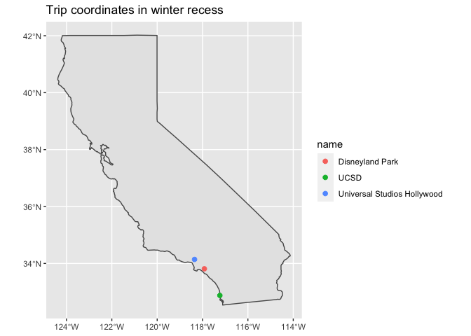

Ruoyu Zhang’s PS07
================

## GitHub Documents

This is an R Markdown format used for publishing markdown documents to
GitHub. When you click the **Knit** button all R code chunks are run and
a markdown file (.md) suitable for publishing to GitHub is generated.

## Introduction

I am Ruoyu (she/her), an undergrad studying *psychology & study of women
and gender (swg)* at Smith College. I am taking **Intro to statistics
and data science** this semester. I use:  
*R  
*Python  
Below is an example of my coursework.

## Plots

<!-- -->

Note that the `echo = FALSE` parameter was added to the code chunk to
prevent printing of the R code that generated the plot.
